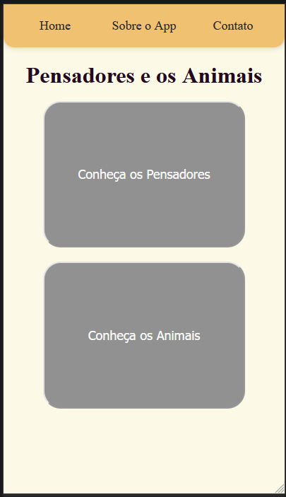
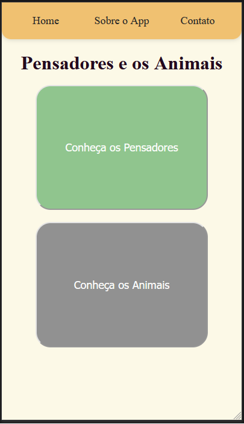
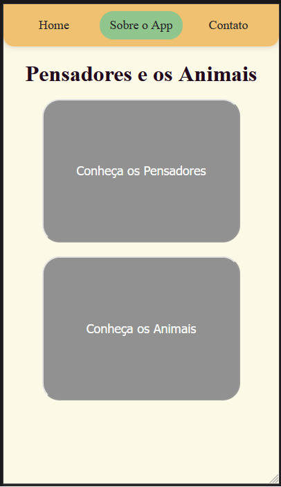
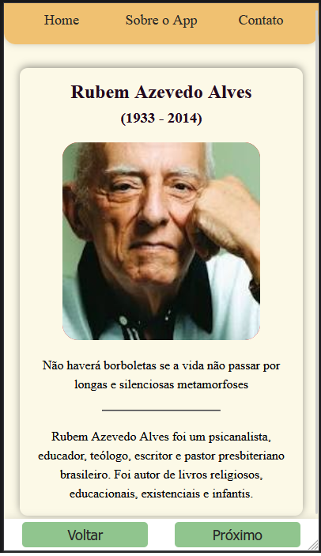
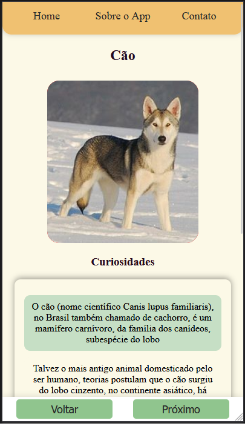
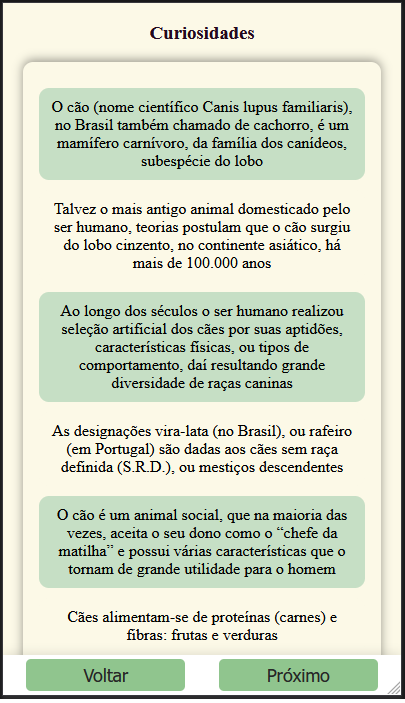
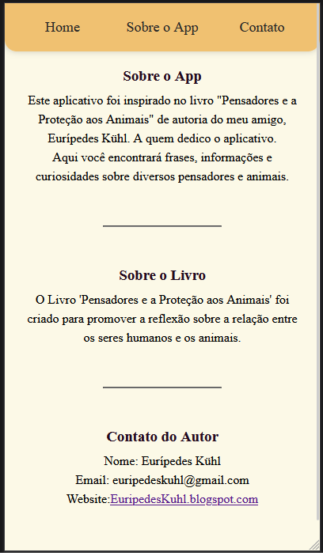
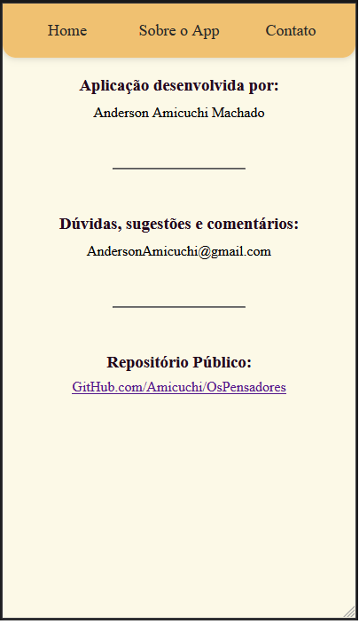
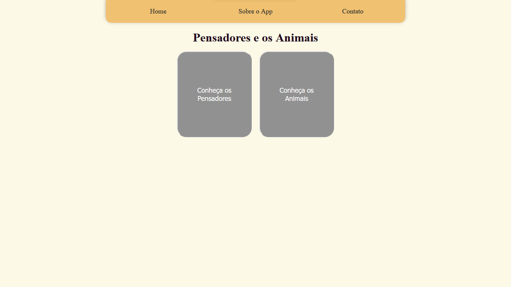
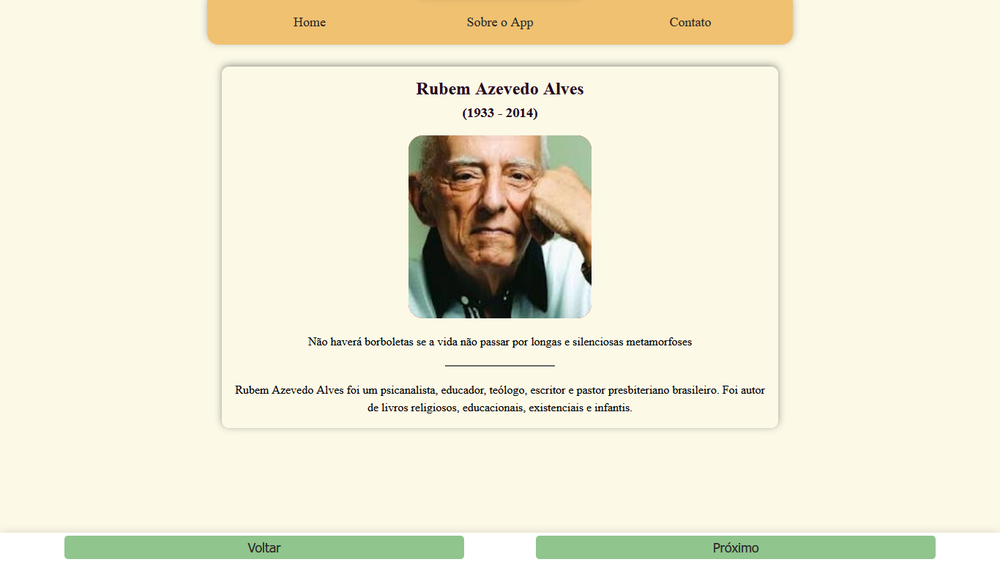

# Os Pensadores e a Proteção aos Animais

## Descrição
Este site é uma homenagem ao amigo Eurípedes Kühl, autor do livro "Pensadores e a Proteção aos Animais" além de diversos outros livros. 

O aplicativo fornece informações sobre diversos pensadores e suas reflexões sobre a relação entre seres humanos e animais, oferecendo um espaço para reflexão e aprendizado.


## Funcionalidades
- Navegação entre diferentes pensadores e suas citações.
- Descubra curiosidades sobre vários animais.
- Informações sobre o autor do aplicativo.


## Uso
Ao abrir o aplicativo, você verá opções para conhecer pensadores e animais.
- Clique em "Conheça os Pensadores" para explorar informações sobre diferentes pensadores.
- Clique em "Conheça os Animais" para descobrir curiosidades sobre diversos animais.


## Tecnologias Utilizadas
- [React](https://reactjs.org/)
- [JavaScript](https://developer.mozilla.org/pt-BR/docs/Web/JavaScript)
- [CSS](https://developer.mozilla.org/pt-BR/docs/Web/CSS)
- [React Router](https://reactrouter.com/)
- [Material-UI](https://mui.com/)


## Telas do app













## Contribuição

Contribuições são bem-vindas! Sinta-se à vontade para abrir issues ou enviar pull requests. 


## Licença

Este projeto é licenciado sob a licença MIT. Veja [LICENSE](LICENSE) para mais detalhes sobre o uso e distribuição.


## Instalação

Para rodar o projeto localmente, siga os passos abaixo:

```bash
# Clone o repositório
git clone https://github.com/Amicuchi/OsPensadores.git

# Navegue até o diretório do projeto
cd OsPensadores

# Instale as dependências
npm install

# Inicie o servidor de desenvolvimento
npm run dev

```


## React + Vite

### Sobre o Vite
O Vite é um build tool que fornece uma experiência de desenvolvimento rápida e moderna para projetos de frontend. Utilizamos o Vite para facilitar o desenvolvimento do nosso aplicativo React.

Atualmente, dois plugins oficiais estão disponíveis.

- [@vitejs/plugin-react](https://github.com/vitejs/vite-plugin-react/blob/main/packages/plugin-react/README.md) uses [Babel](https://babeljs.io/) for Fast Refresh
- [@vitejs/plugin-react-swc](https://github.com/vitejs/vite-plugin-react-swc) uses [SWC](https://swc.rs/) for Fast Refresh


## Agradecimentos:
    * Documentação do React
    * Material-UI


## Contato
Anderson Amicuchi Machado - AndersonAmicuchi@gmail.com